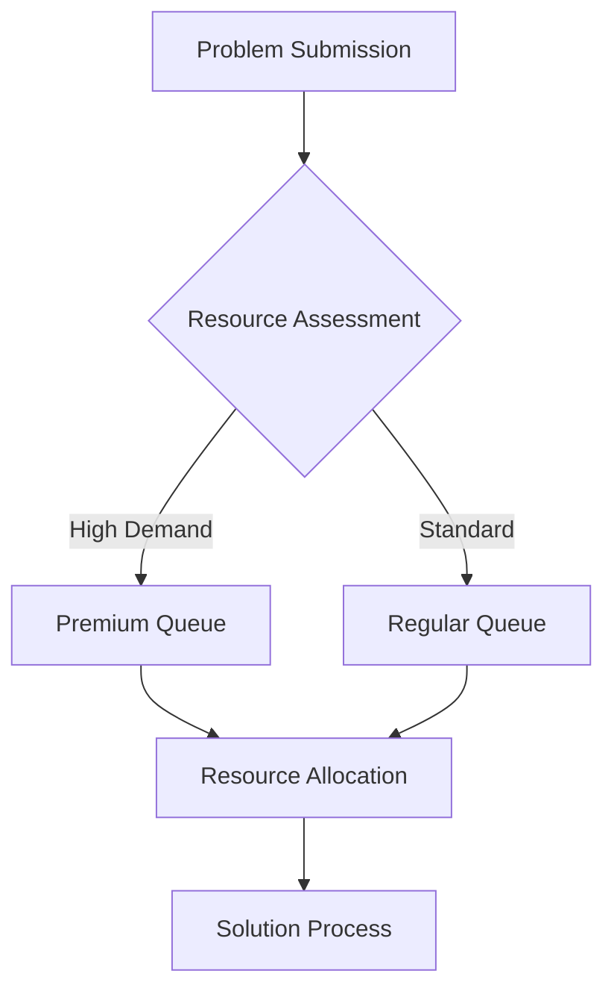

# Quantum-Inspired Swarm Intelligence Network (QSIN)

## System Architecture

A decentralized platform combining quantum-inspired algorithms with swarm intelligence for solving complex optimization problems.

### Core Components

#### 1. Swarm Management System
```
├── Agent Framework
│   ├── Quantum-Inspired Agents
│   │   ├── State Superposition
│   │   └── Quantum Movement
│   └── Swarm Coordinator
└── Problem Space
    ├── Environment Mapper
    └── Solution Evaluator
```

#### 2. Smart Contract Infrastructure
```solidity
contract SwarmNetwork {
    struct Agent {
        uint256 agentId;
        bytes32 stateHash;
        uint16 generation;
        uint256 fitness;
        bool active;
    }
    
    struct Problem {
        uint256 problemId;
        bytes32 definitionHash;
        uint32 complexity;
        uint256[] constraints;
        bool solved;
    }
    
    mapping(uint256 => Agent) public agents;
    mapping(uint256 => Problem) public problems;
}
```

### Swarm Intelligence Implementation

#### 1. Agent Behavior
- Quantum-inspired movement
- Local optimization
- Information sharing
- Collective decision making

#### 2. Performance Metrics
```
Agent Efficiency = (Solution Quality * Speed) / Resource Usage
Swarm Performance = ∑(Agent Contributions) * Convergence Rate
```

### Technical Components

#### Quantum-Inspired Algorithms
1. Core Mechanisms
    - Superposition states
    - Quantum tunneling
    - Entanglement simulation

2. Optimization Methods
    - Quantum walks
    - Interference patterns
    - Probability amplification

#### Platform Architecture
```
├── Core Engine
│   ├── Swarm Controller
│   ├── Problem Solver
│   └── Solution Validator
├── Integration Layer
│   ├── Resource Manager
│   └── Results Analyzer
└── Interface Systems
    ├── Visualization
    └── Control Panel
```

### Resource Management

#### Computation Distribution
1. Task Allocation
    - Agent assignment
    - Resource scheduling
    - Load balancing

2. Performance Tracking
    - Solution quality
    - Resource usage
    - Convergence speed

#### Market Structure


### Economic Model

#### Token Utility
- QSWM (Quantum Swarm) governance token
- Compute credits
- Solution rewards

#### Pricing Mechanism
```
Resource Cost = Base Rate * (Complexity + Priority Level)
Solution Value = Quality Score * (Innovation Factor + Efficiency)
```

### Collaboration Framework

#### Research Tools
1. Analysis Platform
    - Behavior visualization
    - Performance analytics
    - Solution mapping

2. Development Environment
    - Algorithm testing
    - Swarm simulation
    - Results validation

### Security Measures

#### 1. System Protection
- Access control
- Resource isolation
- Attack prevention

#### 2. Solution Verification
- Result validation
- Quality assurance
- Plagiarism detection

### Future Development

#### Phase 1: Foundation
- Basic swarm mechanics
- Simple problem solving
- Core marketplace

#### Phase 2: Enhancement
- Advanced algorithms
- Complex problems
- Enhanced optimization

#### Phase 3: Scaling
- Multi-swarm systems
- Cross-domain solutions
- Global optimization

## Technical Specifications

### Performance Requirements
1. System Metrics
    - Solution accuracy
    - Convergence time
    - Resource efficiency

2. Scaling Capabilities
    - Agent population
    - Problem complexity
    - Network capacity

### Integration Standards

#### 1. API Specifications
- Problem submission
- Resource allocation
- Result retrieval

#### 2. Data Formats
- Problem definitions
- Solution encoding
- Performance metrics

## Implementation Guidelines

### Development Standards
1. Algorithm Quality
    - Optimization efficiency
    - Convergence guarantee
    - Resource utilization

2. System Requirements
    - Processing power
    - Memory allocation
    - Network bandwidth

### Operational Procedures
1. Problem Processing
    - Definition validation
    - Resource allocation
    - Solution verification

2. Quality Control
    - Performance monitoring
    - Result validation
    - System optimization

## Conclusion

The Quantum-Inspired Swarm Intelligence Network provides a powerful platform for solving complex problems through the combination of quantum-inspired algorithms and swarm intelligence principles.
